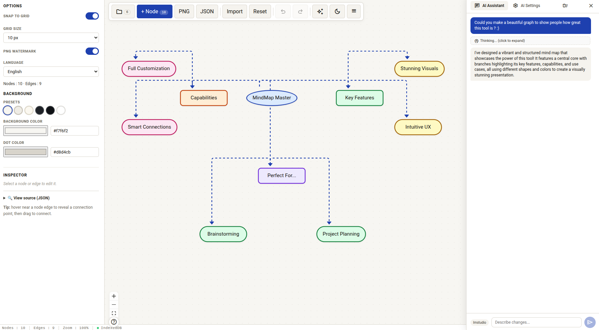

# MindFlow — Interactive Mindmap Editor

A modern, single-file HTML5 mindmap editor with an AI copilot. No build, no server, no accounts. Just open `index.html` and start mapping.

> **🤖 AI-Generated Project** — This entire codebase was created through conversation between a human and Claude Code (Anthropic) in 2025. Every line of code, every feature, every bug fix was generated by AI under human direction. No human wrote any code manually. [Read the conversation →](https://github.com/cabusar/mindflow)

[](https://buymeacoffee.com/cabusar)



## ✨ Features

### Core
- **Single-file, zero-dependency runtime** — one HTML file, works offline
- **Drag & drop** nodes with alignment guides and grid snapping
- **Undo/redo** with full history (Ctrl+Z / Ctrl+Y)
- **Multiple shape**s: rectangle, circle, diamond, pill
- **Custom colors** with 8 presets
- **Edge styles**: Bézier, smoothstep, step, straight, with or without arrows
- **Node resizer** — resize nodes directly on the canvas
- **Edge reconnection** — drag edge endpoints to reconnect
- **Multi-selection** — hold Shift to select multiple nodes
- **Copy/paste** (Ctrl+C / Ctrl+V)
- **Keyboard shortcuts** for everything

### Project Management
- **Multiple projects** stored in IndexedDB (with localStorage fallback)
- **Project drawer** with rename, duplicate, delete
- **Auto-save** on every change
- **Legacy migration** — seamlessly upgrades old single-document format

### Import / Export
- **JSON import/export** with full schema validation
- **PNG export** with optional watermark
- **View source** — inspect the raw JSON from the inspector panel

### AI Copilot
- **Conversational AI sidebar** — describe changes in natural language
- **Streaming responses** with real-time token display
- **Reasoning visualization** — collapsible thinking block for reasoning models (Gemma, DeepSeek-R1)
- **Tool calling** — single `edit_mindmap` tool for precise schema manipulation
- **Multi-provider** — Ollama, LM Studio, DeepSeek, Groq, OpenAI, or any OpenAI-compatible API
- **Model fetching** — auto-discover available models from the endpoint
- **Connection test** with latency feedback
- **Per-provider context size** configuration
- **Conversation memory** persisted per project
- **Clear conversation** button

### UI / UX
- **Dark mode** with auto-detection (`prefers-color-scheme`)
- **Responsive design** — desktop, tablet, mobile (bottom-sheet panels)
- **Material Design icons** via Google Fonts
- **Status bar** with node count, edge count, zoom level, storage mode
- **Loading overlay** — no flash of default content
- **Reduced motion** support (`prefers-reduced-motion`)
- **Internationalization** (EN/FR, switchable in the panel)
- **Focus trap** on mobile panels
- **Touch-optimized** (`touch-action: manipulation`)

### Security
- **Content Security Policy** meta tag
- **React StrictMode**
- **Input sanitization** — all imported data is validated
- **No telemetry, no analytics, no external requests** (except user-configured LLM endpoints)

## 🚀 Quick Start

1. **Download** `index.html`
2. **Open** it in any modern browser (Chrome, Firefox, Safari, Edge)
3. **Start mapping** — click `+ Node` or press `N`

For AI features:
1. Click the ⚙️ settings icon in the AI sidebar
2. Add a provider (e.g., Ollama at `http://localhost:11434/v1`)
3. Click on the provider card to activate it (●)
4. Select a node and describe your changes in the chat

## ⌨️ Keyboard Shortcuts

| Key | Action |
|-----|--------|
| `N` | New node |
| `D` | Duplicate selected node |
| `F` | Fit view |
| `Ctrl+Z` | Undo |
| `Ctrl+Y` | Redo |
| `Ctrl+C` | Copy selected node |
| `Ctrl+V` | Paste node |
| `Delete` | Delete selected |
| `Shift+Click` | Multi-select |
| `Escape` | Close panel |

## 🏗️ Architecture

```
index.html  (single-file, ~7900 lines)
├── <style>         — CSS (light/dark themes, responsive, animations)
├── <script importmap>  — React 18.3, React Flow 12
└── <script type="module">
    ├── Configuration & constants
    ├── I18n (FR/EN)
    ├── Domain logic (validation, schema, history, reducer)
    ├── IndexedDB storage (multi-document CRUD)
    ├── AI subsystem (tools, streaming, providers)
    ├── React components (Toolbar, MindNode, Panels, Sidebar…)
    ├── App shell (ReactFlow, state management)
    └── Self-tests (?test=1)
```

### Dependencies (CDN, no build)

| Package | Version | Usage |
|---------|---------|-------|
| React + ReactDOM | 18.3.1 | UI framework |
| @xyflow/react | 12 | Mindmap canvas |
| html-to-image | 1.11.13 | PNG export |
| Material Symbols | latest | Icons |
| OpenAI-compatible API | any | AI Copilot (optional) |

## 🤖 AI Copilot Setup

### Ollama (local)
```bash
ollama pull llama3.2
OLLAMA_ORIGINS=* ollama serve
```
Then add provider: endpoint `http://localhost:11434/v1`, model `llama3.2`

### LM Studio (local)
- Settings → CORS → Enable
- Add provider: endpoint `http://localhost:1234/v1`, model as configured in LM Studio

### DeepSeek (cloud)
- Add provider: endpoint `https://api.deepseek.com/v1`, model `deepseek-chat`, add your API key

## 📄 License

MIT — [GitHub Repository](https://github.com/cabusar/mindflow) | [Buy Me a Coffee ☕](https://buymeacoffee.com/cabusar)

## 🙏 Acknowledgments

Built with [React Flow](https://reactflow.dev/), [React](https://react.dev/), and [Material Symbols](https://fonts.google.com/icons).
